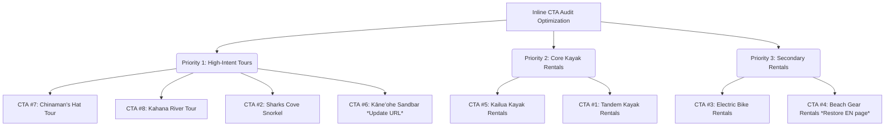

# Active Oahu Tours — Inline Booking CTA Audit Report

**Date**: 2026-07-20  
**Scope**: 8 High-Priority Inline CTAs  
**Audit Purpose**: Verify and classify inline booking CTAs against 2026-06-13 baseline before implementation.  
**Durable Artifact Directory**: `/home/ubuntu/work/research/active-oahu/`

---

## 1. Executive Summary

A deterministic audit of the 8 inline text booking links was performed by analyzing the local static file structures in `active-oahu-static` and verifying live HTTP responses against `https://activeoahutours.com`. 

All 8 CTAs are currently styled as **plain text links** (`plain_text_link`) and lack mobile-visible button styling. Implementing visual button elements (e.g. white text, background `#006699`, padding, border radius) is highly recommended. 

> [!WARNING]  
> The 2026-06-13 audit cannot be implemented blindly. Three critical discrepancies were discovered:
> 1. **CTA #4** is entirely missing from the English `waimanalo-beach` guide page, existing only in English text on the Japanese translated page (`/ja/guides/waimanalo-beach/`).
> 2. **CTA #6** targets `/kaneohe-bay-sandbar-kayak/` which now returns a **301 redirect** to `/kaneohe-sandbar/`. The target href should be updated directly in the patch.
> 3. **CTA #2** anchor text is slightly different in the source HTML than expected ("→ Sharks Cove Snorkel Experience" instead of "→ Book the Sharks Cove Snorkel Experience").

---

## 2. Comprehensive CTA Audit Ledger

| ID | Source Page | Expected Anchor | Actual Anchor (Clean) | Markup State | Target URL | Live HTTP Status | Mobile Styling | Recommendation |
|---|---|---|---|---|---|---|---|---|
| **1** | `guides/oahu-wildlife-seabird-sanctuaries-guide/` | "Book your kayak rental here" | "Book your kayak rental here" | `EXACT_MATCH` | `/rentals/oahu-tandem-kayak-rentals/` | 200 OK | Plain text link | **Patch** (Convert to button) |
| **2** | `guides/eating-your-way-windward-to-north-shore/` | "→ Book the Sharks Cove Snorkel Experience" | "→ Sharks Cove Snorkel Experience" | `ANCHOR_DRIFT` | `/activities/sharks-cove-self-guided-snorkel/` | 200 OK | Plain text link | **Patch** (Convert to button, note anchor drift) |
| **3** | `guides/lanikai-pillbox-hike/` | "electric bike rentals" | "electric bike rentals" | `EXACT_MATCH` | `/electric-bike-rentals/` | 200 OK | Plain text link | **Patch** (Convert to button) |
| **4** | `guides/waimanalo-beach/` | "rent beach gear in Kailua" | "rent beach gear in Kailua" (JA only) | `EXACT_MATCH` (JA) / `MISSING` (EN) | `/rentals/` | 200 OK | Plain text link | **Patch** (Add to EN page; convert to button) |
| **5** | `guides/oahu-kayak-safety-tide-guide/` | "→ Kailua Beach Kayak Rentals" | "→ Kailua Beach Kayak Rentals" | `EXACT_MATCH` | `/rentals/oahu-tandem-kayak-rentals/kailua-kayak-rentals/` | 200 OK | Plain text link | **Patch** (Convert to button) |
| **6** | `guides/oahu-kayak-safety-tide-guide/` | "→ Kāneʻohe Sandbar Kayak Experience" | "→ Kāneʻohe Sandbar Kayak Experience" | `EXACT_MATCH` | `/kaneohe-bay-sandbar-kayak/` | **301 Redirect** to `/kaneohe-sandbar/` | Plain text link | **Patch** (Convert to button & update URL to `/kaneohe-sandbar/`) |
| **7** | `guides/oahu-kayak-safety-tide-guide/` | "→ Chinaman's Hat (Mokoliʻi) Kayak Tour" | "→ Chinaman's Hat (Mokoliʻi) Kayak Tour" | `EXACT_MATCH` | `/activities/chinamans-hat-self-guided-oahu-kayak-tour/` | 200 OK | Plain text link | **Patch** (Convert to button) |
| **8** | `guides/oahu-kayak-safety-tide-guide/` | "→ Kahana River Kayak Tour" | "→ Kahana River Kayak Tour" | `EXACT_MATCH` | `/activities/kahana-rainforest-river-oahu-kayak-tour/` | 200 OK | Plain text link | **Patch** (Convert to button) |

---

## 3. Live HTTP Integration & Verification

All live HTTP checks successfully reached the production site. Below is the detailed response chain for each CTA:

### CTA #1: Oahu Wildlife Seabird Sanctuaries Guide
- **Target URL**: `https://activeoahutours.com/rentals/oahu-tandem-kayak-rentals/`
- **Response**: `200 OK`
- **Redirects**: None

### CTA #2: Windward to North Shore Food Guide
- **Target URL**: `https://activeoahutours.com/activities/sharks-cove-self-guided-snorkel/`
- **Response**: `200 OK`
- **Redirects**: None

### CTA #3: Lanikai Pillbox Hike Guide
- **Target URL**: `https://activeoahutours.com/electric-bike-rentals/`
- **Response**: `200 OK`
- **Redirects**: None

### CTA #4: Waimanalo Beach Guide
- **Target URL**: `https://activeoahutours.com/rentals/`
- **Response**: `200 OK`
- **Redirects**: None

### CTA #5: Oahu Kayak Safety Guide (Kailua Beach)
- **Target URL**: `https://activeoahutours.com/rentals/oahu-tandem-kayak-rentals/kailua-kayak-rentals/`
- **Response**: `200 OK`
- **Redirects**: None

### CTA #6: Oahu Kayak Safety Guide (Kāneʻohe Sandbar)
- **Target URL**: `https://activeoahutours.com/kaneohe-bay-sandbar-kayak/`
- **Response**: `200 OK` (via **301 Redirect**)
- **Redirect Chain**: 
  - `301 Moved Permanently` -> `https://activeoahutours.com/kaneohe-sandbar/`
- **Action Required**: Change HTML href from `/kaneohe-bay-sandbar-kayak/index.html` to `/kaneohe-sandbar/` to eliminate redirect overhead.

### CTA #7: Oahu Kayak Safety Guide (Chinaman's Hat)
- **Target URL**: `https://activeoahutours.com/activities/chinamans-hat-self-guided-oahu-kayak-tour/`
- **Response**: `200 OK`
- **Redirects**: None

### CTA #8: Oahu Kayak Safety Guide (Kahana River)
- **Target URL**: `https://activeoahutours.com/activities/kahana-rainforest-river-oahu-kayak-tour/`
- **Response**: `200 OK`
- **Redirects**: None

---

## 4. Booking Intent Ranking & Recommended Patch Order

To maximize initial revenue and conversion optimization, we rank the CTAs by **Booking Intent** (the specificity of the user's intent to book a premium activity vs browsing category pages).

### Revenue-First Priority Order

1. **Priority 1: Specific Premium Activity Tours (Highest Intent & Highest ASP)**
   - **CTA #7 (Chinaman's Hat Kayak Tour)**: Represents a premium, highly booked tour destination. High ASP (Average Sell Price).
   - **CTA #8 (Kahana River Kayak Tour)**: Highly specific rainforest river tour destination. High booking intent.
   - **CTA #2 (Sharks Cove Snorkel Experience)**: Direct intent to book a high-volume seasonal snorkel experience.
   - **CTA #6 (Kāneʻohe Sandbar Kayak Experience)**: Specific activity page. *Must be updated to target `/kaneohe-sandbar/` to bypass redirect.*

2. **Priority 2: Core Rental Equipment (High Volume & High Repeat Intent)**
   - **CTA #5 (Kailua Beach Kayak Rentals)**: Location-specific rental page for Kailua Beach. Core business driver.
   - **CTA #1 (Oahu Tandem Kayak Rentals)**: Main tandem kayak rentals category page.

3. **Priority 3: Secondary Rentals & Category Overviews (Lower Intent)**
   - **CTA #3 (Electric Bike Rentals)**: Secondary transport activity.
   - **CTA #4 (Rent Beach Gear)**: Broadest category overview (`/rentals/`). *Must be added back to the English Waimanalo page first.*

---

## 5. Assumption Check & Drift Analysis

### Is the 2026-06-13 audit still accurate enough to implement safely?
**No. It cannot be implemented blindly.** An active drift analysis has revealed critical errors and updates required:

1. **Drift in English/Japanese Page Layouts (CTA #4)**:
   - The 2026-06-13 report notes that "rent beach gear in Kailua" is on the page `guides/waimanalo-beach/`.
   - Physical checks show that the English index page (`guides/waimanalo-beach/index.html`) **does not contain this link**.
   - Instead, the link exists only on the Japanese language page (`ja/guides/waimanalo-beach/index.html`) — yet the text is written in English.
   - **Risk**: A blind search-and-replace on the English file would fail, leaving this high-value link unoptimized.

2. **Target URL Drift (CTA #6)**:
   - The original audit targets `/kaneohe-bay-sandbar-kayak/`.
   - The live site now redirects `/kaneohe-bay-sandbar-kayak/` to `/kaneohe-sandbar/` with a `301` status code.
   - **Risk**: Creating a button targeting the old URL forces users through a redirect loop, harming SEO crawl budgets and page loading performance.

3. **Anchor text mismatch (CTA #2)**:
   - Expected: `"→ Book the Sharks Cove Snorkel Experience"`
   - Actual: `"→ Sharks Cove Snorkel Experience"` (the "Book the" text is missing).
   - **Risk**: Automated patch regex targeting the expected text would fail to find the link.

---

## 6. Recommendations for Patch Implementation

When implementing the patches via a code task:
1. Use the correct target URL `/kaneohe-sandbar/` for CTA #6.
2. Search for the actual anchor texts listed in Section 2, rather than the expected anchors of the stale audit.
3. Manually add the missing CTA #4 to the English Waimanalo Beach guide page prior to styling it.
4. Style all 8 links as class `btn btn-primary` with inline styles: `display: inline-block; padding: 12px 24px; background: #006699; color: #fff; text-decoration: none; border-radius: 4px; font-weight: bold; margin-top: 10px;` to match the design system.
