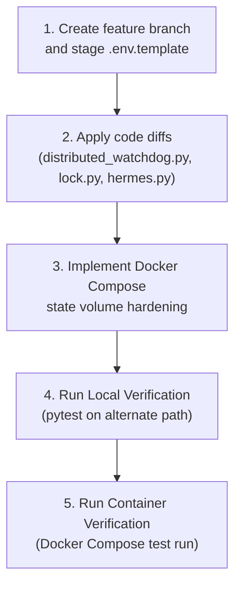

# Technical Specification: Portability & Abstraction Epic (Track A)

This document provides a deep-dive design specification for **Track A (Portability Epic)**. It outlines the exact code refactoring diffs, environment variable configurations, Docker Compose volume hardening, and validation commands required to decouple the Prismatic Engine from VM 800.

---

## 1. Hardcoded Path Refactoring Specs

We will replace the hardcoded `/home/ubuntu` default strings across the Python codebase with dynamic, cross-platform path resolution using `pathlib.Path.home()` or `Path.cwd()`.

### A. distributed_watchdog.py
*   **Target File:** `prismatic/distributed_watchdog.py` ([distributed_watchdog.py#L56](file:///home/ubuntu/work/prismatic-engine/prismatic/distributed_watchdog.py#L56))
*   **Diff Spec:**
```diff
-PRISMATIC_HOME = Path(os.environ.get("PRISMATIC_HOME", "/home/ubuntu"))
+PRISMATIC_HOME = Path(os.environ.get("PRISMATIC_HOME", Path.home()))
```

### B. lock.py
*   **Target File:** `prismatic/lock.py` ([lock.py#L54](file:///home/ubuntu/work/prismatic-engine/prismatic/lock.py#L54))
*   **Diff Spec:**
```diff
-_PRISMATIC_HOME = Path(os.environ.get("PRISMATIC_HOME", "/home/ubuntu"))
-LOCK_FILE = _PRISMATIC_HOME / ".antigravity" / "swarm_locks.json"
+_PRISMATIC_HOME = Path(os.environ.get("PRISMATIC_HOME", Path.home()))
+LOCK_FILE = Path(os.environ.get("ANTIGRAVITY_LOCK_FILE", _PRISMATIC_HOME / ".antigravity" / "swarm_locks.json"))
```

### C. hermes.py
*   **Target File:** `prismatic/agents/hermes.py` ([hermes.py#L140](file:///home/ubuntu/work/prismatic-engine/prismatic/agents/hermes.py#L140))
*   **Diff Spec:**
```diff
-        prismatic_home = os.environ.get("PRISMATIC_HOME", "/home/ubuntu")
+        prismatic_home = os.environ.get("PRISMATIC_HOME", str(Path.home()))
         for candidate in [
             Path(prismatic_home) / "work",
             Path("/workspace"),
-            Path(".").resolve(),
+            Path.cwd(),
         ]:
```

---

## 2. Environment Schema Configuration (`.env.template`)

We will create a `.env.template` file at the root of `prismatic-engine` and `prismatic-web-plugin` to document all environment-configurable variables.

```ini
# ==============================================================================
# Prismatic Environment Configuration Template
# ==============================================================================

# Core Integration Coordinates
LINEAR_API_KEY=your_linear_api_key_here
LINEAR_TEAM_ID=GRO

# Directories & Path Resolving (Defaults to dynamic paths if unset)
# PRISMATIC_HOME=/custom/home/path
# PRISMATIC_STATE_DIR=./prismatic_state
# ANTIGRAVITY_LOCK_FILE=~/.antigravity/swarm_locks.json
# PRISMATIC_NODE_ROSTER=/tmp/prismatic/swarm_nodes.json

# Networking Coordinates
PRISMATIC_IDE_IP=127.0.0.1
PRISMATIC_DASHBOARD_PORT=9001
```

---

## 3. Docker Compose Hardening (State Volume Bug Fix)

Currently, the containerized setup runs inside Docker but does not mount a persistent volume for the state database folder (`/app/prismatic_state`). This causes all node health logs to be wiped whenever the container is recreated.

We will modify [docker-compose.yml](file:///home/ubuntu/work/prismatic-engine/docker-compose.yml) to add state volume mounting:

```yaml
version: "3.9"

services:
  prismatic-engine:
    build: .
    image: prismatic-engine:latest
    container_name: prismatic-engine
    restart: unless-stopped
    environment:
      - LINEAR_API_KEY=${LINEAR_API_KEY:?LINEAR_API_KEY is required}
      - LINEAR_TEAM_ID=${LINEAR_TEAM_ID:-GRO}
      - PRISMATIC_NUDGE_DIR=/tmp/prismatic
      - PRISMATIC_STATE_DIR=/app/prismatic_state
    volumes:
      - prismatic_nudge:/tmp/prismatic
      - prismatic_state:/app/prismatic_state
      - ./config:/etc/prismatic:ro
    ports:
      - "9001:9001"

volumes:
  prismatic_nudge:
  prismatic_state:
```

---

## 4. Step-by-Step Swarm Execution Plan

Here is the exact task roadmap for Fred and the AGY swarm to execute this Epic safely:



### Swarm Commands for Local Verification
The swarm can execute these commands inside their sandbox to test the changes:
```bash
# Set environment overrides to non-standard paths
export PRISMATIC_HOME="/tmp/prismatic-test-home"
export ANTIGRAVITY_LOCK_FILE="/tmp/prismatic-test-home/custom_locks.json"
export PRISMATIC_STATE_DIR="/tmp/prismatic-test-home/state"

# Run tests
pytest tests/
```
