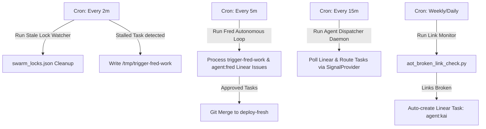

# Swarm Automation Audit Report: Resolving Stalls & Activating Autonomy
**Date:** 2026-06-12  
**Author:** Antigravity (Antigravity CLI)  
**Status:** Complete — Pure Research Audit  

---

## 1. Executive Summary
This audit analyzes the current state of Michael's multi-agent swarm (Fred/Orchestrator, Ned, AGY, Jules CLI (jules.google.com), Kai, Codex) across 5+ ventures. Currently, the swarm is stalled in a **reactive state**, where execution is dependent on manual user intervention (e.g., chatting with Fred, manually pushing files, or manually creating/triggering tasks). 

While Phase 1 (conventions and specs) is marked as complete, the **Prismatic Engine** remains a "paper engine" with zero implementation issues created in the backlog and critical components (like `swarm.js` and hooks) completely missing from the workspace. This report identifies the structural bottlenecks, defines the missing pieces, specifies concrete BUILD issues, and outlines a critical path to achieve autonomous execution.

---

## 2. Root Cause Analysis: Reactive vs. Proactive Swarm
The swarm remains reactive rather than proactive due to four core architectural flaws:

### A. Lack of Autonomous Execution Windows (The Fred Bottleneck)
*   **The Orchestrator is Passive:** The orchestrator profile (`fred` / `orchestrator`) is only active when Michael manually initiates a chat session. There is no autonomous daemon or background cron running the Fred profile in an execution loop.
*   **Trigger Files Accumulate Unread:** When the nudge executor detects a stalled task, it successfully writes the target issue to `/tmp/trigger-fred-work`. However, because Fred has no background execution daemon, this trigger file sits there unconsumed.
*   **Mismatched Profiles:** `fred` is a symlink to `/home/ubuntu/.hermes/profiles/orchestrator`. While the orchestrator gateway is running as a service (`hermes-orchestrator-gateway.service`), it functions purely as a messaging platform listener and does not autonomously poll or work on task queues.

### B. Broken Handoff Chain
*   **Label-Based Deadlocks:** The handoff workflow relies on shifting Linear labels (e.g., `agent:ned` completes → labels `agent:fred`). Because Fred is passive, the issue sits in Fred's queue indefinitely.
*   **Disconnected Research-to-Build Transition:** When AGY completes a research task (like the audio inventory review `GRO-1271`), it posts its findings in Linear comments. There is no automated script or active agent parser that reads these comments, extracts deliverables, and decomposes them into next-phase implementation issues. The work dies in the comments section.
*   **Ned Sweep Side-Effects:** Ned runs background maintenance sweeps (`ned_sweeps_v2.py`). If Ned finds an issue in `In Progress` with the `agent:ned` label, it swaps the label to `agent:fred` rather than executing the task. This pushes work back to the passive orchestrator, stalling the pipeline.

### C. The Missing "Paper" Prismatic Engine
*   **No Claims/Mutex Implementation:** The file claim and locking system (`swarm.js`) described in the 7-step loop specification is completely missing from the workspace. A search across all mirror and static checkouts confirms that `swarm.js` was never written.
*   **No Pre-Push Enforcer:** The pre-push git hook (`GRO-1218`) is not installed in the active repositories, meaning lane governance is not enforced and conflict prediction (`Layer 5`) is non-existent.
*   **Dispatcher is Offline:** The standalone event dispatcher (`prismatic.dispatcher` / `agent_dispatcher.py`) is not running as a daemon. It is only run occasionally via the Hermes orchestrator cron job, which has high overhead.

### D. Empty Queue / Idle Mode Failures
*   **No Idle Fallback Triggered:** When there are no agent-specific tasks in the queue, the agents sleep instead of executing growth work (SEO, schema injections, outreach). 
*   **AOT Link Monitor Errors:** The `aot_broken_link_check.py` script successfully audits the static mirror and finds 200+ broken links. However, it exits with `sys.exit(1)`. In the cron scheduler, a non-zero exit code marks the job status as "failed," hiding the report and preventing any automated agent (like Kai) from receiving the link inventory to fix them.

---

## 3. Missing Pieces (Ranked by Impact)

| Rank | Component | Impact | Description |
| :---: | :--- | :---: | :--- |
| **1** | **Fred Autonomous Executor Daemon** | **10/10** | A persistent background runner or frequent cron loop that boots Fred headlessly to process `/tmp/trigger-fred-work` and `agent:fred` issues without human chat intervention. |
| **2** | **Swarm Lock Manager (`swarm.js`)** | **9/10** | The core CLI tool to lock, unlock, and query file claims, preventing agents from colliding and overwriting each other's changes. |
| **3** | **Git Pre-Push Hook & Lane Enforcer** | **8/10** | A repository-level git hook that validates branch prefixes, checks file ownership against `PRISMATIC_ENGINE.yaml`, and rejects pushes if locks are not held. |
| **4** | **Automated Task Decomposer** | **8/10** | A parser script that reads completed research comments, extracts files/deliverables, and automatically creates follow-up Linear issues for next-phase implementation. |
| **5** | **Unified Dispatcher Daemon Service** | **7/10** | Running `agent_dispatcher.py` as a persistent systemd service instead of calling it via an LLM-driven cron prompt every 15 minutes. |
| **6** | **Idle Mode/Revenue Fallback Triggers** | **7/10** | Integration of the Idle-Mode Policy (`GRO-30-POLICY`) to force AGY and Kai to autonomously generate SEO content and outreach research when queues are empty. |
| **7** | **Conflict Predictor (Phase 4)** | **6/10** | Performs a pre-push diff against staging to catch overlapping modifications before they reach the remote repository. |

---

## 4. Concrete BUILD Issues to Be Created

The following concrete implementation issues must be created in Linear to move past the research phase:

### [BUILD] Implement Swarm Mutex Locking CLI (`swarm.js`)
*   **Goal:** Build the filesystem locking utility for the Prismatic Engine.
*   **Scope:** `.antigravity/swarm.js` at workspace roots.
*   **Description:** Develop a lightweight Node.js CLI that implements:
    *   `lock <filepath> <threadId>`: Writes claim to `.antigravity/swarm_locks.json` if not already locked.
    *   `unlock <filepath> <threadId>`: Releases the lock.
    *   `status`: Prints all active locks.
    *   `heartbeat <threadId>`: Updates the `lastHeartbeat` timestamp for all locks held by the thread.
*   **Acceptance Criteria:**
    *   Locks are correctly recorded in `swarm_locks.json` with microsecond timestamps.
    *   Double locks by different threads are rejected with a clear error.
    *   Lock status prints in a clean tabular format.

### [BUILD] Implement Git Pre-Push Lane Governance Hook
*   **Goal:** Enforce lane compliance and branch discipline at git push.
*   **Scope:** `.git/hooks/pre-push`
*   **Description:** Write a shell/Python hook that reads `PRISMATIC_ENGINE.yaml` and:
    *   Rejects pushes to staging (`deploy-fresh`) unless the pushing agent is Fred.
    *   Rejects pushes to `main` for all agents.
    *   Validates that all changed files are within the agent's allowed directories.
    *   Verifies that the agent holds active claims in `swarm_locks.json` for all modified files.
*   **Acceptance Criteria:**
    *   Hook successfully blocks out-of-lane file modifications.
    *   Attempts to push directly to staging by worker agents are rejected.
    *   Bypassing the hook requires manual user override.

### [BUILD] Deploy Stale Lock Watcher & Heartbeat Daemon
*   **Goal:** Clean up abandoned file locks from crashed or terminated agent sessions.
*   **Scope:** `prismatic/nudge_executor.py` / new cron script.
*   **Description:** Deploy a lightweight background task that runs every 2 minutes. It reads `swarm_locks.json`, calculates the age of `lastHeartbeat`, and:
    *   If `now - lastHeartbeat > 300000` (5 minutes) → deletes the lock entry.
    *   Logs the release: `[SwarmLock] Auto-released stale lock on <file> held by <agent>`.
*   **Acceptance Criteria:**
    *   Stale locks are cleared automatically without manual intervention.
    *   Active locks with running heartbeats remain untouched.

### [BUILD] Build Automated Research-to-Task Decomposer
*   **Goal:** Bridge the gap between research completion and implementation.
*   **Scope:** `ops/prismatic_decomposer.py`
*   **Description:** Build a script that runs after an AGY or Kai research task is completed. It parses the final walkthrough comment on Linear, identifies files/deliverables, and programmatically creates sub-tasks or follow-up tasks in the Linear backlog assigned to the correct worker agent.
*   **Acceptance Criteria:**
    *   Script extracts file paths and target descriptions from the review comment.
    *   Automatically creates linked Linear issues with correct labels (e.g. `agent:kai` for content, `agent:ned` for databases).
    *   Lints and formats the created task descriptions.

### [BUILD] Refactor Broken Link Monitor Exit Codes & Automation
*   **Goal:** Prevent the link monitor from failing in cron and connect it to execution.
*   **Scope:** `/home/ubuntu/.hermes/profiles/orchestrator/scripts/aot_broken_link_check.py`
*   **Description:** Refactor the link checker:
    *   Always exit with code 0 if the audit completes successfully.
    *   Format findings as a markdown report.
    *   If broken links > 0, automatically create a Linear issue: `[FIX] Broken link audit: <count> pages affected` and label it `agent:kai`.
*   **Acceptance Criteria:**
    *   Cron status shows "ok" instead of "failed" for successful runs.
    *   Broken link counts and paths are automatically dispatched to Kai as actionable tickets.

---

## 5. Critical Path (The 3 Changes for 80% Improvement)

To unlock immediate autonomous output and reduce manual overhead, execute these three changes first:

1.  **Run Fred in an Autonomous Background Loop:**  
    Set up a background service for the `orchestrator` profile that runs every 5 minutes, checks `/tmp/trigger-fred-work`, pulls `agent:fred` issues, processes them headlessly, merges approved branches, and pushes to staging. This eliminates the chat bottleneck.
2.  **Deploy the Swarm Lock Manager (`swarm.js` + pre-push hook):**  
    Build and distribute the lock manager and git hook to the active-oahu and darius-star repositories. This secures the multi-agent coordination layer and prevents repository collision.
3.  **Automate Research Decomposition:**  
    Deploy the decomposer script to automatically parse completed audit/research comments and spin up the next-phase build issues in Linear. This keeps the pipeline moving without manual issue drafting.

---

## 6. Swarm Agent Role Definitions

To prevent lane overlap and clearly divide responsibilities, the agent profiles are defined as follows:

*   **Fred (Orchestrator & Staging Governor):**
    *   *Lanes:* `src/`, `infra/`, `deploy/`, `.github/` (Read-only: `content/`)
    *   *Role:* AGY is the final reviewer and approver. Fred orchestrates and routes. AGY merges into staging and handles approvals."
*   **Kai (Hawaii Tourism & Content Specialist):**
    *   *Lanes:* `content/`, `active-oahu/`, `tours/` (Read-only: `src/`)
    *   *Role:* **Expanded Hawaii Tourism Specialist.** Kai is responsible for generating, optimizing, and localizing all text content, SEO elements, schema templates, and guides for all Hawaii tourism categories across the static mirror.
*   **AGY (Senior Architect, Designer, & Auditor):**
    *   *Lanes:* `assets/`, `designs/`, `research/` (Read-only: `src/`, `content/`)
    *   *Role:* Swarm architect, design system curator, security auditor, and visual QA enforcer. AGY reviews Kai's content changes and Fred's code changes before integration.
*   **Ned (Hygiene & Database Administrator):**
    *   *Lanes:* `database/`, `.gitignore`, `assets/large/`
    *   *Role:* Database schemas, repository cleanliness (repo size reductions, LFS assets), background maintenance sweeps, and git config verification.
*   **Jules CLI (PR Auditor & Linter):**
    *   *Lanes:* Read-only across all directories.
    *   *Role:* Quality assurance, pull request code review, compiling, and running automated syntax/linter checks.
*   **Codex (Module & Code Refactoring Specialist):**
    *   *Lanes:* `src/` (Read-only for review, write access for approved refactoring branches).
    *   *Role:* Code structure optimization, converting legacy modules (e.g. to ES modules), and writing unit tests.

---

## 7. Recommended Cron & Daemon Architecture

The cron architecture should be restructured to focus on **execution** rather than passive reporting:

### Active Jobs Configuration

1.  **Prismatic Dispatcher Daemon (`prismatic-dispatcher.service`):**  
    Run the unified dispatcher (`agent_dispatcher.py`) as a persistent systemd service that polls Linear every 30 seconds. This replaces the slow, agent-based 15-minute cron.
2.  **Stale Lock Watcher & Escalator Cron:**  
    Runs every 2 minutes. Clears locks older than 5 minutes and escalates stalled worker tasks to Fred via `/tmp/trigger-fred-work`.
3.  **Fred Autonomous Task Runner Cron:**  
    Runs every 5 minutes. Pulls trigger files and `agent:fred` issues, executes tests, merges to staging, and posts status summaries to Telegram.
4.  **Actionable Link Monitor Cron:**  
    Runs weekly. Runs `aot_broken_link_check.py` (which exits 0 on completion) and automatically generates repair tickets labeled `agent:kai` if broken links are discovered.
5.  **Ned Sweeper Cron:**  
    Runs every 15 minutes to clear completed tasks and sync git configs across agent profiles.
